# Written Analysis: School District Analysis
> Analyzing the scores for the school board using Pandas.

## Table of Contents
* [Overview of the project](#overview-of-the-project)
* [Results](#results)
* [Summary](#summary)

## Overview of the project
The purpose of this project is to analyze the test results for about fifteen different schools.The main analysis is focused on the performance of reading and math scores for all schools. After the school board reviewed all the data, it was determined that the data for Thomas High School's ninth grade class was compromised. The school board wants the data for them removed and then analyse the overall results again for a fair review. This project uses Pandas library to modify the data into tables and summarize the overall district and school metrics.

## Results

Below are the snapshots of the overall results of this analysis.

* District Summary 
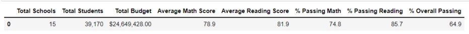

* School Summary with ninth graders 
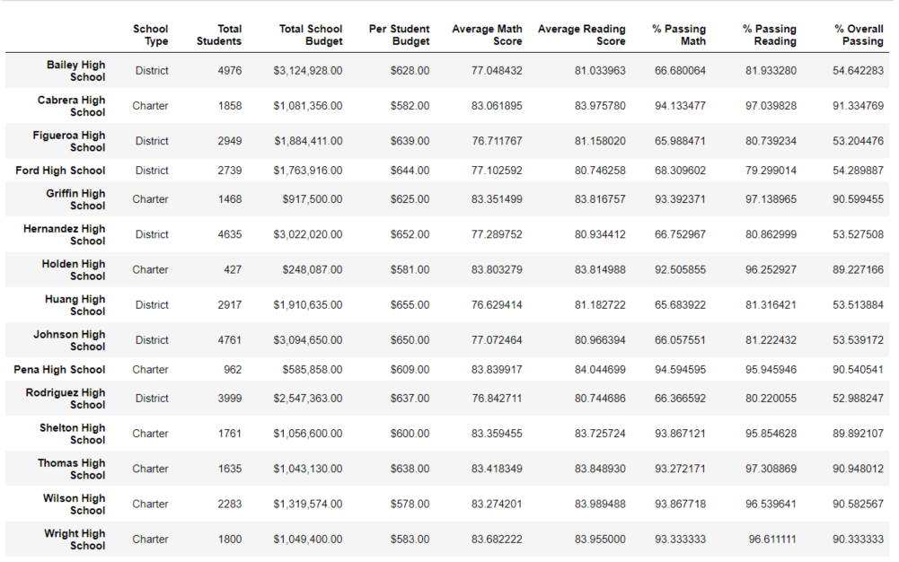

* School Summary after removing the ninth graders 
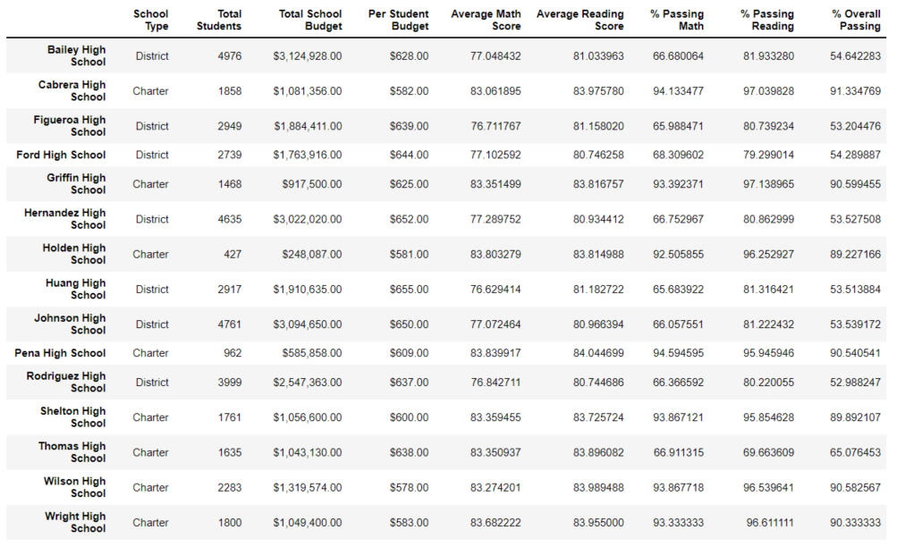

* Spending Summary 
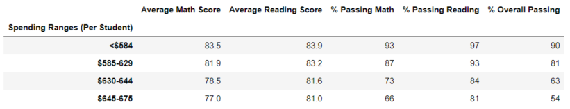

* School Size Summary 
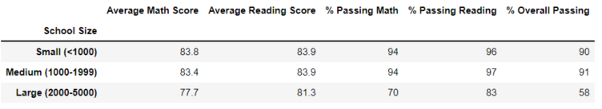

* School Type Summary 
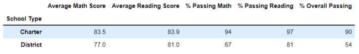

* Top Five Schools 
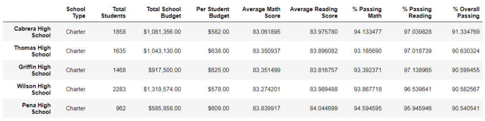

* Bottom Five Schools 
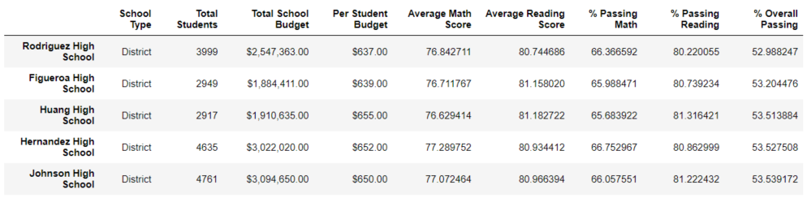

**1. How is the district summary affected?** 
* The overall difference in scores was less than 1%, when we removed less than 500 test scores on the 40,000 student data set. 
  The percentage of Math decreased from 75% to 74.8% and the overall passing went down to 64.9% from 65%. 
  
**Original Disrict Summary** 

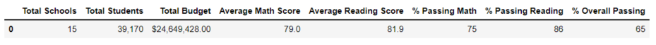

**Adjusted Disrict Summary** 

**2. How is the school summary affected?** 
* Removing the ninth graders of the Thomas High School from the original data set had a huge impact on the overall passing rates numbers, with a drop to 65% as compared to a whooping 91%,in the original analysis.

 
**Original School Summary** 

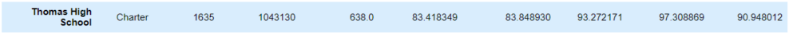

**Adjusted School Summary** 

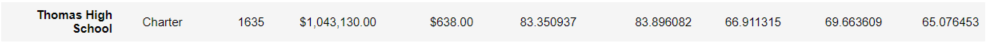

**3. How does replacing the ninth graders’ math and reading scores affect Thomas High School’s performance relative to the other schools?** 
* Replacing the data from the ninth graders's math and reading scores has no impact on other schools data. In the original analysis, the overall passing for Thomas High School landed at 91% whereas when the data was removed and adjusted, the overall performance of Thomas High School decreased to 65%. 

**4. How does replacing the ninth-grade scores affect the following:** 
* Math and reading scores by grade. 
  - Thomas High School had and average of 83.6 in math and 83.7 in reading for the 9th graders , in the original analysis. Now, these scores have been replaced with NaN and looks as below

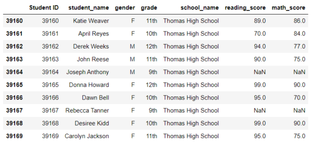

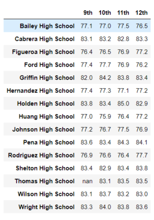

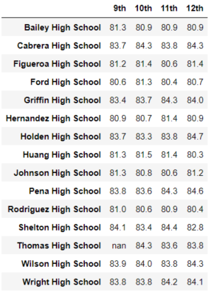

* Scores by school spending. 
  - There was very little to no impact on spendings by changing the 9th grade scores. Thomas High School falls under the $630 to $644/student spending range.

* Scores by school size and school type 
  - There was very little to no impact on the scores based on the school type or size.The numbers will be the same if converted to whole numbers. Thomas High School falls under the Charter School type and is defined as a medium sized school.

**Original Scores by School size and type** 
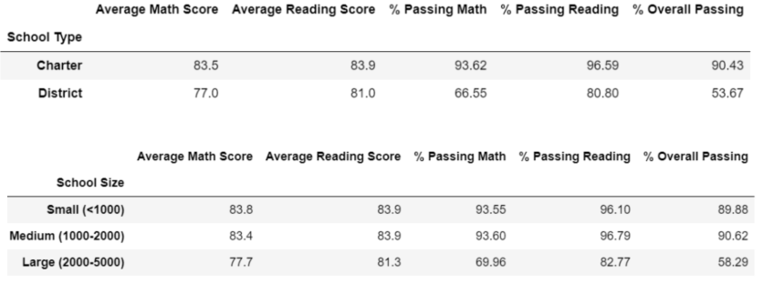

**Adjusted Scores by School size and type** 
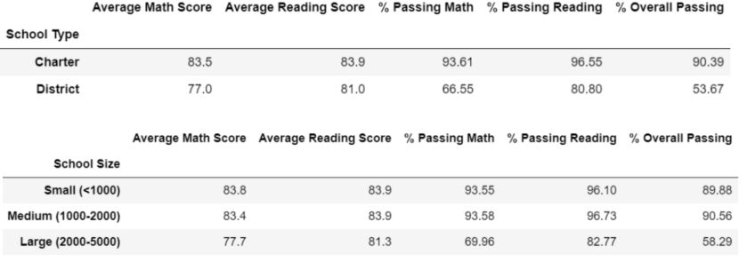

## Summary

Four changes in the updated school district analysis after reading and math scores for the ninth grade at Thomas High School have been replaced with NaNs are as below. 

   - Thomas High School's ranking dropped.
   - The overall passing rate changed.
   - The district as a whole also has its average math and reading scores decreased due to the decrease in the averages for the Thomas High School.
   - The data at the grade level now displays as NaN in reports for the 9th graders of Thomas High School.
 

